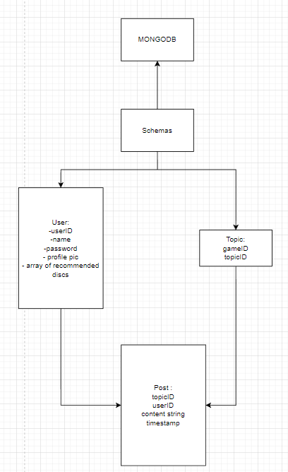
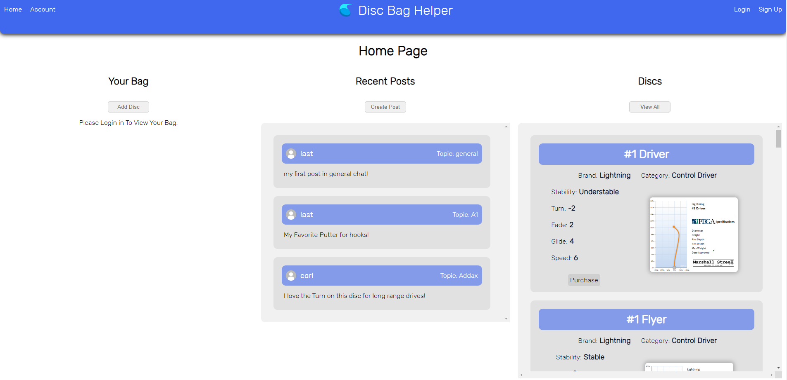
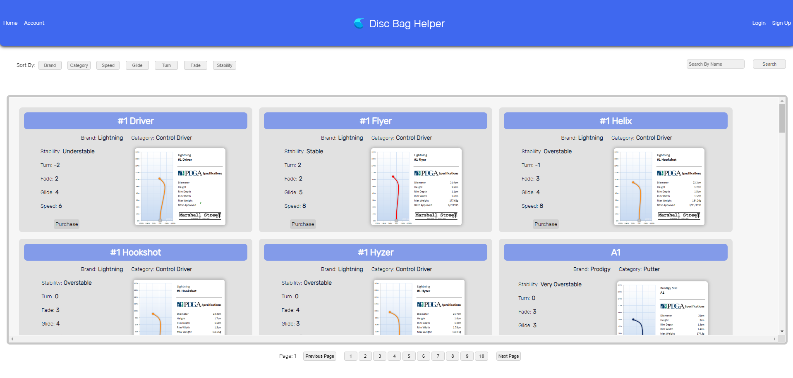

# **Disc Golf Bag Helper**

### Carl Menke

### 9/16/2022

#### [GitHub](https://github.com/carlmenke) | [LinkedIn](https://www.linkedin.com/in/carl-menke-333226139/)

## **_Description_**

This A Full-stack CRUD browser-based account based program written in React.js, Mongoose, Express.js, and Node.js which I coded two weeks after being introduced to these languages. It is used to curate your own disc bag and search for the discs to need with guidence.

---

## **_Screenshots_**

ERD:

Final Application Screenshots:

---

## **_Technologies_**

- React.js
- Mongoose
- MongoDB
- Express.js
- Node.js
- Javascript

---

## **_Roadmap (Future Updates)_**

- ~~Add Personal bag feature~~
- Create More Accurate bag scores.
- Sort by topics on home page
---

## **_Getting Started_**

https://dgb-client.herokuapp.com/viewDiscs

The Entity Relationship Diagram and Component Hierarchy Diagram I used to develop this application can be found on my **[Trello Board](https://trello.com/b/ybdinFoQ/everything-games)**

1. Sign up for an account
2. Add discs to your bag through the hame page
3. Continiue until you have a score of 100!
